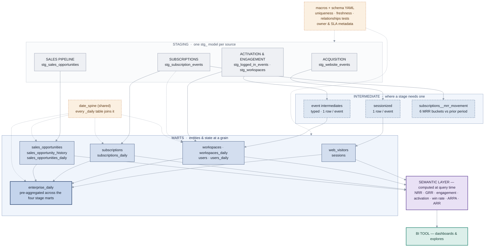

# Air — System Diagram

One picture of the model in [2_data_model.md](2_data_model.md). Read it **top to bottom as lineage, left to right as stage**:

- **Bands** (top → bottom) are the dbt layers — **staging** (one `stg_` model per source) → **intermediate** (only where a stage needs one) → **mart** → **semantic layer** → **BI**.
- **Within each band**, the columns are the four business stages — Acquisition, Activation & Engagement, Subscriptions, Sales Pipeline — each carried straight down its own column.

`enterprise_daily` is **not** a separate layer: it's just another mart in the marts column that happens to pre-aggregate the four stage marts and reach BI directly. Everything else — every rate and ratio — is computed at query time in the semantic layer, never materialized.

Color, not shape, carries meaning: staging · intermediate (dashed) · mart · enterprise mart · semantic layer · BI · shared aside.

