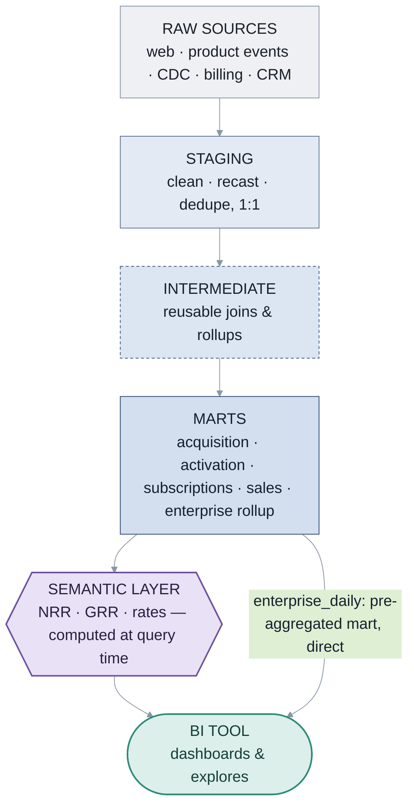
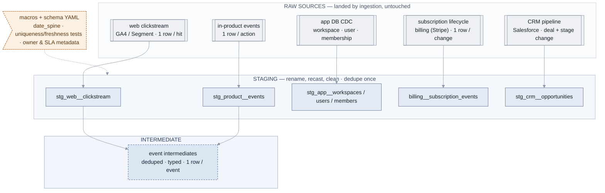
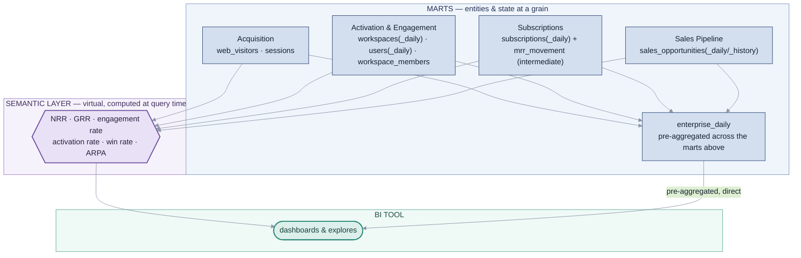

# Air — System Diagram

Lineage from [data_model.md](data_model.md): raw → staging → intermediate → marts → semantic layer → BI.

Shapes: ▭ materialized table · ⬡ computed at query time, not stored · ⬭ application. Dashed = macro/YAML documentation, aside.

## Overview

## Upstream — raw → staging → intermediate

## Downstream — marts → semantic layer → BI

`enterprise_daily` is a mart — it aggregates the marts beside it and reaches BI directly; every other rate/ratio goes through the semantic layer.

